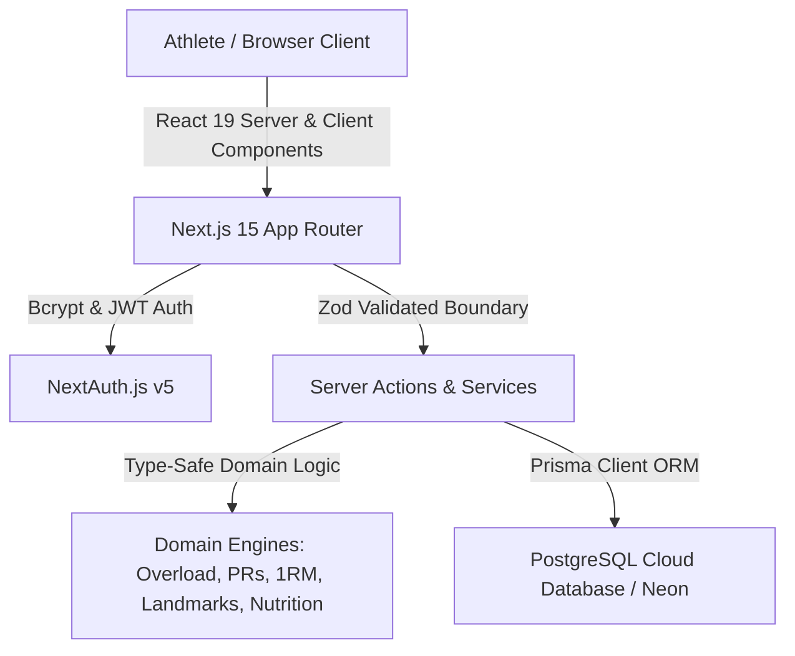

# GymOS — Complete Feature & Capability Specification

> **Platform Overview**: GymOS is a high-performance, deterministic fitness operating system engineered for athletes, powerlifters, and bodybuilders. It follows a continuous improvement cycle: **Plan → Train → Log → Analyze → Overload**.

---

## 📑 Table of Contents
1. [3D Motion Landing Page](#1-3d-motion-landing-page-)
2. [Authentication & Multi-Tenant Security](#2-authentication--multi-tenant-security)
3. [Athlete Command Center (Dashboard)](#3-athlete-command-center-dashboard)
4. [Live Interactive Workout Logger](#4-live-interactive-workout-logger)
5. [Deterministic Progressive Overload & PR Detection](#5-deterministic-progressive-overload--pr-detection)
6. [AI Coach Antigravity & Routine Architect](#6-ai-coach-antigravity--routine-architect)
7. [Scientific Hypertrophy Volume Landmarks](#7-scientific-hypertrophy-volume-landmarks)
8. [Analytics Deep-Dive & Visualizations](#8-analytics-deep-dive--visualizations)
9. [Nutrition, Macro Fueling & Hydration](#9-nutrition-macro-fueling--hydration)
10. [Strength Standards & 1RM Calculator](#10-strength-standards--1rm-calculator)
11. [Athlete Profile & Data Portability (JSON/CSV)](#11-athlete-profile--data-portability-jsoncsv)
12. [System Architecture & Tech Stack](#12-system-architecture--tech-stack)

---

## 1. 3D Motion Landing Page (`/`)
* **3D Tunnel & Hero Section**:
  * Powered by Three.js and custom GLSL vertex/fragment shaders with continuous motion and responsive camera perspective.
  * Kinetic athlete photography stream with smooth cubic-bezier physics.
  * `FocusReveal` staggered text reveal animation.
* **Live Proof & Metrics Ticker**:
  * `0.0s` Fast Logging Latency.
  * `100%` Deterministic Progressive Overload.
  * `10–20` Hypertrophy Set Landmark Engine.
  * `100%` Data Portability (JSON/CSV exports).
* **High-Performance Bento Grid**:
  * Large Hero Bento showcasing the live set logger, active load inputs, and previous set comparison.
  * AI Coach snippet previewing intelligent deload advice and plateau breakthrough logic.
  * Hypertrophy Volume Landmark meter preview.
  * Macro Fuel token breakdown (Protein, Carbs, Fat).
  * Strength Standards tier classification preview.
* **The 4-Step Continuous Overload Loop**:
  * **01. Plan** → **02. Train** → **03. Analyze** → **04. Overload** step-by-step cycle breakdown with iconography and hover-reactive card states.
* **Side-by-Side Comparison Matrix**:
  * GymOS Athletic OS vs. Generic Fitness Trackers.
* **High-Impact Cyberpunk Call to Action (CTA)**:
  * High-visibility pure white typography with emerald ambient glow and zero-friction signup link.
* **Dark Athletic Footer**:
  * Quick links to Dashboard, Logger, Coach, Nutrition, Strength Standards, and Analytics.

---

## 2. Authentication & Multi-Tenant Security
* **NextAuth.js v5 (Auth.js Beta)**:
  * JWT session strategy with `trustHost: true` for cloud serverless deployments (Vercel).
  * Bcrypt salted password hashing with strict Zod boundary validation.
* **Multi-Tenant Data Isolation**:
  * Strict database access rules (`where: { userId: session.user.id }`).
  * Server Actions authenticate requests server-side before querying the database.
* **Auth Pages**:
  * `/login`: Sign in with email and password with instant redirect to dashboard.
  * `/register`: Account creation with automatic onboarding profile generation.
  * `/forgot-password`: Password reset request flow.

---

## 3. Athlete Command Center (Dashboard) (`/dashboard`)
* **Top Athlete Greeting Bar**:
  * Personalized athlete greeting with live **🔥 14-Day Consistency Streak** badge and **Today's Focus** indicator.
  * High-energy **"+ Start Workout"** and **"Quick Log Meal"** actions.
* **4-Card KPI Grid**:
  * **Circular Weekly Consistency Ring**: Visual SVG radial meter (e.g. 4/5 days completed) with active **M T W T F S S** day completion dots.
  * **Volume Tonnage**: Total kg lifted with an upward trend badge (`+12.4%`) and emerald sparkline.
  * **Personal Records**: Total broken PRs with gold trophy icon and highlight badge for latest PR.
  * **Daily Fuel & Macro Gauge**: Calorie progress bar paired with 3 colored micro-gauges for **Protein (Blue)**, **Carbs (Amber)**, **Fat (Rose)**, and **Water (Cyan)**.
* **2-Column Command Center**:
  * **Left Column**:
    * **Active Program Routine Card**: Displays current routine exercises, target rep ranges, and **🟢 Overload Ready (+2.5kg)** badges.
    * **Hypertrophy Volume Landmarks Widget**: Real-time progress bars measuring direct working sets per muscle against the 10–20 weekly set threshold.
  * **Right Column**:
    * **AI Coach Intelligence Feed**: Contextual advice on fatigue, plateaus, and training recommendations.
    * **1-Tap Quick Hydration Logger**: Live water volume tracker with 1-tap `+250ml`, `+500ml`, and `+1.0L` logging buttons.
    * **1RM Strength Standards Tier Badges**: Displays current tier (Intermediate, Advanced, Elite) across Bench Press, Squat, and Deadlift.

---

## 4. Live Interactive Workout Logger (`/workouts`)
* **Live Session Top Bar**:
  * Real-time elapsed stopwatch clock.
  * Live cumulative workout tonnage lifted (`kg`).
  * Completed set counter (`X / Total`).
* **Active Exercise Hero**:
  * Quick exercise selector navigation pills.
  * Search & add custom or system exercises from database modal.
  * Prominent **🟢 Overload Target Badge** with 1-tap *"Use Target"* button.
  * **Scientific Warm-Up Ramp Drawer**: 1-tap calculation displaying warmup progression sets (e.g. 40kg × 5, 60kg × 3, 80kg × 2).
  * **Previous Workout Reference**: Displays the exact weights, reps, and RPE logged in the previous session right above the active set.
* **High-Contrast Set Table**:
  * Completed rows highlighted with weight PR badges.
  * Glowing active set input card with numeric inputs for Weight (kg) and Reps.
  * Optional RPE rating selector (1 to 10).
  * 1-Tap *"Complete Set"* trigger.
* **Floating Rest Timer Overlay**:
  * Glassmorphic countdown overlay with pulse animation.
  * Customizable rest durations (e.g., 90s, 120s, 180s).
  * Quick `+30s` increment and `Skip` controls.
  * **Synthesized Audio Chime**: Native Web Audio API chime alerting the athlete when rest ends.

---

## 5. Deterministic Progressive Overload & PR Detection
* **Deterministic Overload Engine**:
  * Evaluates previous performance against target rep ranges:
    * *Reps < Min Reps*: Maintain current weight, aim for minimum reps.
    * *Reps within Range*: Maintain current weight, increase target by +1 rep.
    * *Reps ≥ Max Reps*: Increase weight by +2.5 kg (or +1.25 kg for smaller muscle groups), reset target to minimum reps.
    * *RPE < 7 at Max Reps*: Automatically prompts weight increase due to low exertion.
* **Real-Time PR Detection Engine**:
  * Automatically evaluates every completed set for 4 distinct PR categories:
    1. **Weight PR**: Heaviest load ever lifted for the exercise.
    2. **Rep PR**: Highest rep count achieved at a given load.
    3. **Volume PR**: Highest single-set tonnage (`weight × reps`).
    4. **Estimated 1RM PR**: Highest calculated 1RM based on the Epley formula.
  * Emits live celebration badges and saves records to the `PersonalRecord` table.

---

## 6. AI Coach Antigravity & Routine Architect (`/coach`)
* **Interactive AI Coach Chat (Left Column)**:
  * Conversational interface analyzing athlete performance data, rep velocity, and training volume.
  * Generates plateau breakthrough recommendations, deload schedules (-10% load), and symmetry tips.
  * Quick-action suggestion chips (*"Analyze Bench plateau"*, *"Check Upper/Lower ratio"*, *"Suggest Deload Plan"*, *"Calculate Calorie Target"*).
* **Deterministic Split Routine Architect (Right Column)**:
  * Goal selector: **Hypertrophy / Muscle Gain**, **Pure Strength**, **Fat Loss**, **General Fitness**.
  * Frequency selector: **3-Day Full Body**, **4-Day Upper/Lower**, **5-Day PPL/UL**, **6-Day Push/Pull/Legs**.
  * Equipment filter: **Commercial Gym (Barbells + Machines + Cables)**, **Home Gym (Dumbbells + Bench)**, **Bodyweight / Calisthenics**.
  * Day-by-day workout schedule generator with 1-tap *"Save to My Schedule"* database synchronization.
* **Biometric Recovery & Readiness Heatmap**:
  * Visual muscle readiness percentages (*Chest 90%, Shoulders 85%, Back 75%, Quads 30%*).
  * Upper vs. Lower body volume ratio calculation.

---

## 7. Scientific Hypertrophy Volume Landmarks
* **Evidence-Based Volume Zones**:
  * Compares weekly direct working sets against established scientific hypertrophy landmarks:
    * **< 6 sets/week**: *Maintenance Volume (MV)*
    * **6–9 sets/week**: *Minimum Effective Volume (MEV)*
    * **10–20 sets/week**: *Maximum Adaptive Volume (MAV — Optimal Hypertrophy Zone)*
    * **> 20 sets/week**: *Maximum Recoverable Volume (MRV — Overtraining Risk)*
* **Interactive Visualizer**:
  * Color-coded progress bars across Chest, Back, Shoulders, Biceps, Triceps, Quads, Hamstrings, Glutes, and Calves.
  * Real-time warnings when volume approaches or exceeds MRV.

---

## 8. Analytics Deep-Dive & Visualizations (`/analytics`)
* **Timeframe Filters**: `7 Days`, `30 Days`, `90 Days`, `1 Year`, `All-Time`.
* **4 Overview Metric Cards**:
  * Total Volume Tonnage lifted (kg) with percentage trend.
  * Workouts Completed with average session duration (minutes).
  * Total Sets & Reps logged.
  * Total Personal Records broken.
* **Multi-Week Volume Progression Chart**:
  * Smooth Neon Emerald gradient area chart showing cumulative weekly training tonnage.
* **Muscle Group Distribution Donut**:
  * Visual breakdown of training load across upper body, lower body, and individual muscle groups.
* **52-Week Training Frequency Heatmap**:
  * GitHub-style calendar grid tracking weekly consistency, rest days, and training density.
* **Exercise Progression Dual-Line Graph**:
  * Interactive exercise selector comparing historical **Estimated 1RM** vs. **Actual Working Weight** over time.

---

## 9. Nutrition, Macro Fueling & Hydration (`/nutrition`)
* **BMR & TDEE Calorie Calculator**:
  * Uses the **Mifflin-St Jeor / Harris-Benedict formula** incorporating body weight, height, age, biological sex, and activity level.
  * Automatically calculates calorie surplus/deficit based on fitness goals (*Muscle Gain: +300 kcal, Fat Loss: -500 kcal, Maintenance: 0 kcal*).
* **Dynamic Macro Breakdown**:
  * **Protein**: Calculated at 2.0g–2.2g per kg of bodyweight.
  * **Fats**: Set to 20%–25% of total caloric intake.
  * **Carbohydrates**: Fills remaining caloric allowance to maximize glycogen stores.
* **Meal Logger**:
  * Categorized by **Breakfast**, **Lunch**, **Dinner**, and **Snacks**.
  * Real-time calorie and macro summation against daily targets.
* **Built-in 30+ Food Library**:
  * Pre-loaded nutritional library (Chicken Breast, Oats, Whey Isolate, White Rice, Eggs, Salmon, Almonds, Peanut Butter, Olive Oil, etc.) with 1-tap portion scaling (grams, scoops, cups).
* **Hydration Tracker**:
  * Daily water target progress bar with 1-tap `+250ml`, `+500ml`, and `+1.0L` logging.

---

## 10. Strength Standards & 1RM Calculator (`/calculator`)
* **Multi-Formula 1RM Engine**:
  * Side-by-side calculation of:
    * **Epley**: $1\text{RM} = \text{weight} \times (1 + \frac{\text{reps}}{30})$
    * **Brzycki**: $1\text{RM} = \text{weight} \times \frac{36}{37 - \text{reps}}$
    * **Lombardi**: $1\text{RM} = \text{weight} \times \text{reps}^{0.10}$
* **Rep Max Load Breakdown Table**:
  * Displays corresponding loads for 1RM, 2RM, 3RM, 5RM, 8RM, 10RM, 12RM, and 15RM (from 100% down to 65% of 1RM).
* **Compound Lift Strength Standards**:
  * Classifies athlete performance across **Bench Press**, **Back Squat**, **Deadlift**, and **Overhead Press** into 5 distinct tiers based on bodyweight multipliers:
    1. **Beginner** (< 1.0x BW)
    2. **Novice** (1.0x – 1.25x BW)
    3. **Intermediate** (1.25x – 1.5x BW)
    4. **Advanced** (1.5x – 2.0x BW)
    5. **Elite** (> 2.0x BW)

---

## 11. Athlete Profile & Data Portability (`/profile`)
* **Athlete Biometrics**:
  * Name, email, date of birth, height, current bodyweight, weekly workout frequency target.
  * Unit preference toggle (**Metric kg / Imperial lbs**).
* **100% Data Portability (No Lock-In)**:
  * **Export Complete JSON Backup**: Full download of user profile, programs, workout sessions, exercise sessions, set logs, PRs, and body measurements.
  * **Export Workout History (CSV)**: Formatted CSV spreadsheet ready for Microsoft Excel, Google Sheets, or custom Python analysis.

---

## 12. System Architecture & Tech Stack

* **Framework**: Next.js 15 (App Router with Turbopack).
* **Language**: TypeScript (Strict mode enabled, `noUncheckedIndexedAccess: true`, zero `any`).
* **Styling**: Tailwind CSS v4 + Obsidian Dark Athletic Design System (`#0A0D12`, `#12161F`, `#10B981`).
* **ORM & Database**: Prisma ORM with PostgreSQL (Serverless Neon Cloud Database).
* **3D Graphics & Animations**: Three.js, Motion (Framer Motion), Lucide React.
* **Testing**: Vitest with **86 automated unit tests passing** across 14 test suites.
